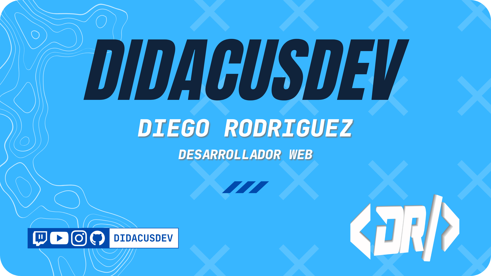

<p align="center">
  <a href="https://github.com/didacusdev">
    
  </a>
</p>

<p align="center">
  
</p>
<p align="center">
  Fullstack developer focused on scalable systems, clean architecture, and developer experience.<br>
  I think in trade-offs, design for maintainability, and care about observability and performance from day one.<br>
  <br>
  Desarrollador Fullstack enfocado en sistemas escalables, arquitectura limpia y experiencia de desarrollo.<br>
  Pienso en trade-offs, diseño para la mantenibilidad y me preocupo por la observabilidad y el rendimiento desde el primer día.
</p>

<br>

<p align="center">
  🔭 &nbsp;<b>Building / Construyendo:</b> apps Fullstack con TypeScript &nbsp;|&nbsp;
  📐 &nbsp;<b>Deep-diving / Profundizando:</b> AI Engineering &amp; MCP &nbsp;
</p>

<br>

---

<h3 align="center">Technologies I Use / Tecnologías que uso</h3>
<p align="center">
  
</p>

```ts
const profile = {

  // Things I've shipped to production and know deeply
  // Lo que he llevado a producción y domino en profundidad
  core_expertise: {
    frontend: {
      languages:     ["HTML", "CSS", "JavaScript", "TypeScript"],
      frameworks:    ["Angular", "Astro"],
      libraries:     ["React", "Preact", "HTMX"],
      styling:       ["Tailwind", "Bootstrap"],
      preprocessors: ["SASS", "PUG"]
    },
    backend: {
      languages:              ["PHP", "Python", "JavaScript", "TypeScript"],
      frameworks:             ["Laravel", "Express", "FastAPI", "Flask"],
      runtimes:               ["Node.js", "Deno"],
      middleware_and_tooling: ["Zod", "JWT", "Mongoose", "Axios", "Helmet", "Morgan"],
      api_documentation:      ["Swagger / OpenAPI"]
    },
    databases: {
      relational:     ["MySQL", "PostgreSQL", "SQL Server", "SQLite"],
      non_relational: ["MongoDB"]
    }
  },

  // Areas I care about beyond writing features
  // Áreas que me importan más allá de escribir funcionalidades
  deep_interests: {
    devops:     ["Docker", "GitHub Actions"],
    monitoring: ["Grafana"],                         // observability from day one / observabilidad desde el día uno
    testing: {
      unit_integration: ["Jest", "Vitest", "Pytest", "Pest"],
      load_performance: ["Locust", "Artillery"]      // I test at scale / pruebo a escala
    },
    design: ["Figma", "Adobe XD"],
    agile:  ["SCRUM", "Kanban"]
  },

  // Actively learning & exploring / Aprendiendo y explorando activamente
  currently_exploring: {
    ai_engineering: {
      protocols:    ["MCP (Model Context Protocol)"],
      fundamentals: ["Machine Learning", "Big Data"]
    },
    concepts: ["Clean Architecture", "System Design", "Design Patterns"]
  },

  // Day-to-day workflow / Flujo de trabajo diario
  workflow: {
    package_managers: ["pnpm", "npm", "composer", "pip", "maven"],
    version_control:  ["Git", "GitHub"],
    api_clients:      ["Postman", "Insomnia"],
    documentation:    ["Notion", "Swagger / OpenAPI"]
  },

  // Teaching since 2022 / Docente desde 2022
  professional_profile: {
    teaching:      ["Programming", "Web Development", "Marketing"],
    documentation: ["Notion"]
  }

};
```

<br>

---

<h3 align="center">Engineering Philosophy / Filosofía de Ingeniería</h3>
<p align="center">
  
</p>

```json
{
  "engineeringPhilosophy": [
    "Observability is not optional / La observabilidad no es opcional",
    "Testability is architecture / La testeabilidad es arquitectura",
    "Docs ship with the feature / La documentación es parte de la funcionalidad",
    "Write for the next developer / Escribe para el siguiente desarrollador",
    "Proven tech for critical paths / Tecnología probada para rutas críticas",
    "Load tests in CI, not post-mortems / Pruebas de carga en CI, no en post-mortems"
  ]
}
```

> [!NOTE]
> I am constantly learning to improve every day / Me mantengo en constante aprendizaje para mejorar cada día.

<br>

---

<h3 align="center">Featured Projects / Proyectos Destacados</h3>
<p align="center">
  
</p>

<div align="center">

| Project / Proyecto | Stack | Highlights / Aspectos clave |
|--------------------|-------|-----------------------------|
|**[Portfolio — diegorodriguez.dev](https://diegorodriguez.dev)** | Astro · TypeScript · Tailwind | Static-first · 100 Lighthouse score · edge deploy |
|**[MCP-Servers](https://github.com/didacusdev/MCP-Servers)** | TypeScript · MCP SDK | 2 servidores MCP (OnePiece + Geolocalizar) · publicado en Smithery |
|**[Formacion Node + Express](https://github.com/didacusdev/Formacion_node_express)** | Node.js · Express · MongoDB · Swagger | API RESTful dictada como formación DAW · CI/CD · versionado semántico |
|**[PDF Reader](https://github.com/didacusdev/PDF_Reader)** | JavaScript · PDF.js · PageFlip · Vite | Lector de PDF con efecto 3D de libro · fullscreen · zoom · teclado |

</div>

<br>

---

<h3 align="center">Main Organizations / Principales Organizaciones</h3>
<p align="center">
  <a href="https://github.com/didacusdev-org">
    
  </a>
  &nbsp;
  <a href="https://github.com/Haonter-ERP">
    
  </a>
</p>

---

<!-- <h3 align="center">GitHub Stats / Estadísticas de GitHub</h3>

<p align="center">
  
</p>

<p align="center">
  
</p>

<br>

--- -->

<h3 align="center">Find me / Encuéntrame</h3>
<p align="center">
  
</p>
<p align="center">
  <a href="https://diegorodriguez.dev">
    
  </a>
  &nbsp;
  <a href="https://instagram.com/didacusdev">
    
  </a>
  &nbsp;
  <a href="https://twitch.tv/didacusdev">
    
  </a>
   &nbsp;
  <a href="https://linkedin.com/in/didacusdev">
    
  </a>
</p>
